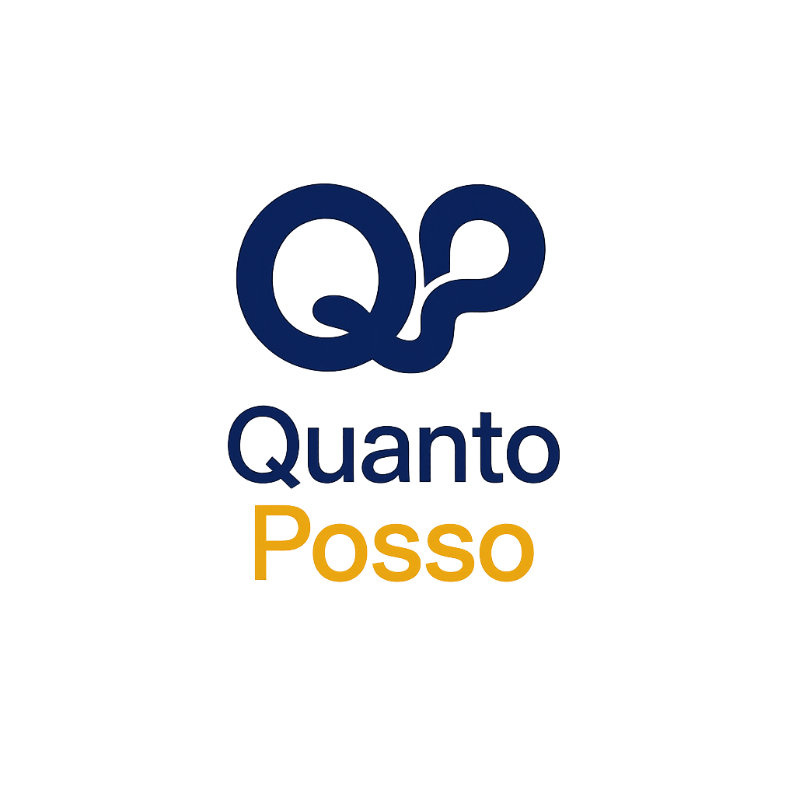
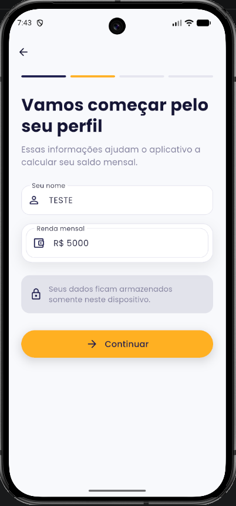
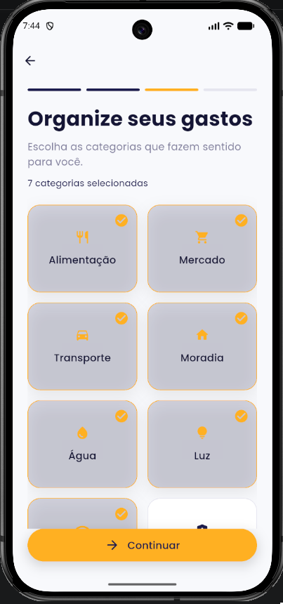
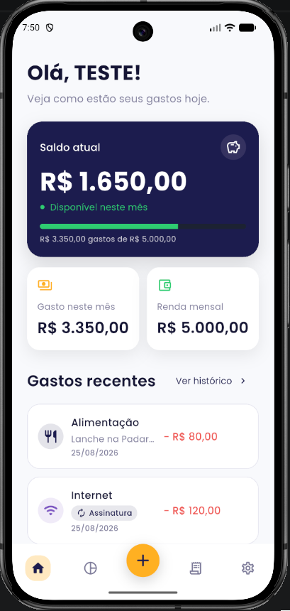
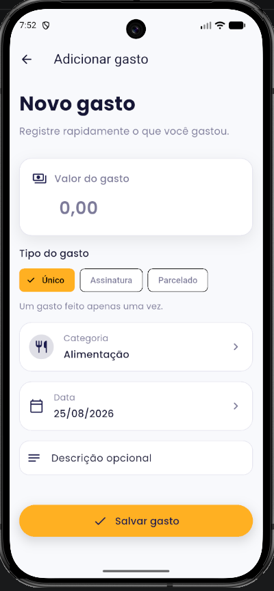
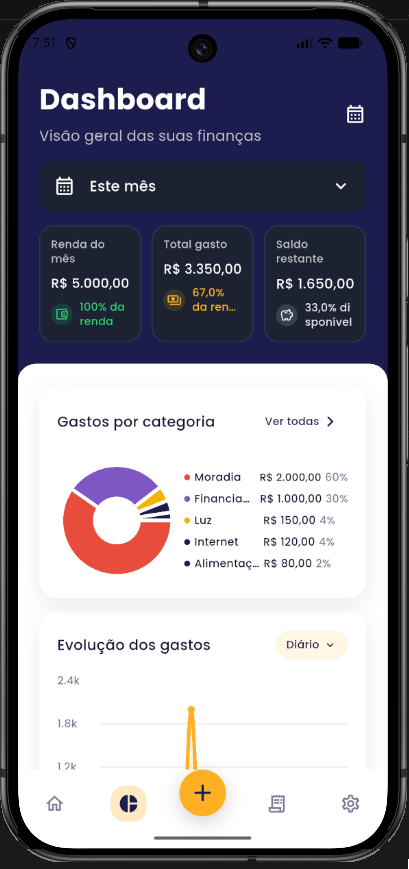
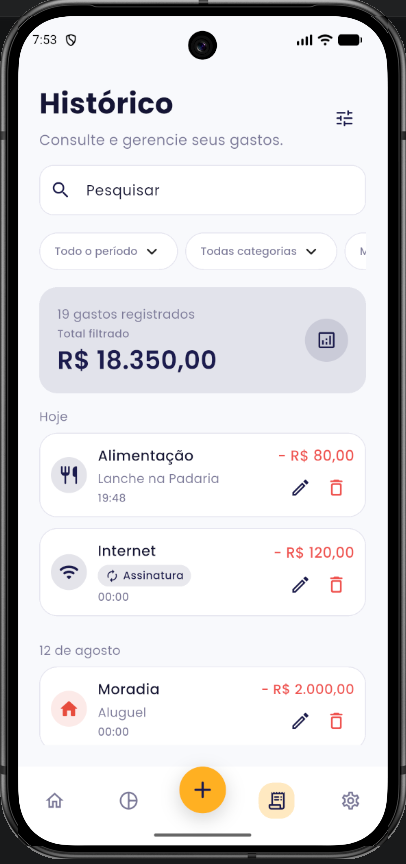
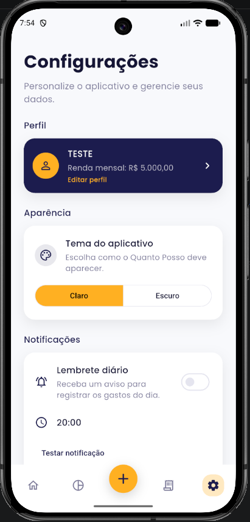

<div align="center">
  

  # Quanto Posso

  **Controle seus gastos, entenda seus hábitos e saiba quanto ainda pode gastar.**

  Aplicativo Flutter de finanças pessoais, simples e offline-first.
</div>

## Sobre o projeto

O **Quanto Posso** ajuda a acompanhar os gastos do mês de forma prática. A partir da renda informada, o aplicativo mostra quanto já foi gasto, quanto ainda está disponível e como as despesas estão distribuídas.

Os dados financeiros permanecem no dispositivo. O aplicativo funciona sem conta, sem conexão obrigatória com a internet e sem enviar informações financeiras para servidores externos.

## Principais recursos

- Cadastro de renda mensal e perfil financeiro.
- Registro, edição e exclusão de gastos.
- Categorias personalizáveis com cores e ícones.
- Visão rápida do total gasto e do saldo disponível no mês.
- Dashboard com evolução diária e mensal, ranking e distribuição por categoria.
- Histórico com busca e filtros.
- Controle de assinaturas, parcelas e outros gastos recorrentes.
- Alertas de orçamento e lembretes diários por notificação local.
- Temas claro e escuro.
- Exportação e restauração de backup.

## Privacidade em primeiro lugar

O Quanto Posso foi desenvolvido com uma abordagem **offline-first**:

- perfil, categorias e gastos são armazenados localmente com SQLite;
- preferências são mantidas no próprio dispositivo;
- lembretes e alertas usam notificações locais;
- nenhuma conta ou serviço externo é necessário para usar o aplicativo.

> O arquivo de backup contém dados financeiros pessoais. Guarde-o em um local seguro.

## Telas do aplicativo

### Primeiros passos

No primeiro acesso, o aplicativo apresenta sua proposta, solicita o nome e a renda mensal e permite selecionar as categorias que fazem parte da rotina do usuário.

<p align="center">
  
  
  
</p>

### Experiência principal

Depois da configuração inicial, é possível acompanhar o saldo, registrar gastos, analisar os dados financeiros, consultar o histórico e personalizar o aplicativo.

<p align="center">
  
  
  
</p>

<p align="center">
  
  
</p>

## Tecnologias

- [Flutter](https://flutter.dev/) e Material Design para a interface.
- [Provider](https://pub.dev/packages/provider) e `ChangeNotifier` para gerenciamento de estado.
- [SQLite](https://pub.dev/packages/sqflite) para os dados financeiros.
- [SharedPreferences](https://pub.dev/packages/shared_preferences) para preferências locais.
- [FL Chart](https://pub.dev/packages/fl_chart) para gráficos.
- [Flutter Local Notifications](https://pub.dev/packages/flutter_local_notifications) para lembretes e alertas.

## Arquitetura

O aplicativo segue um fluxo em camadas para separar interface, regras de estado e persistência:

```text
UI (features e componentes compartilhados)
                    ↓
Provider (estado e coordenação)
                    ↓
Repository (acesso aos dados)
                    ↓
SQLite / SharedPreferences
```

```text
lib/
├── app/           # Composição do app e Design System
├── core/          # Banco, notificações, serviços e utilitários
├── features/      # Telas e fluxos organizados por funcionalidade
├── models/        # Modelos imutáveis e mapeamento de dados
├── providers/     # Estado e operações assíncronas
├── repositories/  # Persistência local
└── shared/        # Componentes, cards, inputs, gráficos e navegação
```

Consulte [docs/architecture.md](docs/architecture.md) para conhecer as responsabilidades de cada camada, o banco de dados e as regras de evolução do projeto.

## Como executar

### Pré-requisitos

- [Flutter SDK](https://docs.flutter.dev/get-started/install) compatível com Dart `^3.12.2`.
- Android Studio ou Visual Studio Code com as extensões Flutter e Dart.
- Emulador configurado ou dispositivo físico conectado.

### Instalação

```bash
git clone https://github.com/andrediascris/quanto-posso.git
cd quanto-posso
flutter pub get
flutter run
```

Confira se o ambiente está configurado corretamente com:

```bash
flutter doctor
```

## Qualidade e testes

Antes de enviar alterações, execute:

```bash
dart format lib test
flutter analyze
flutter test
```

Os testes cobrem modelos, repositories, providers, fluxos de backup, gastos recorrentes e componentes de interface.

## Build de produção

Android:

```bash
flutter build appbundle --release
```

iOS, em um ambiente macOS com assinatura configurada:

```bash
flutter build ipa --release
```

As credenciais de assinatura são locais e não devem ser adicionadas ao repositório.

## Status

Versão atual: **1.0.0**

O projeto está em desenvolvimento ativo. A experiência principal funciona localmente em Android e a validação de build iOS sem assinatura pode ser executada pelo workflow do GitHub Actions.

## Contribuição

Contribuições são bem-vindas. Para colaborar:

1. Crie uma branch a partir de `main`.
2. Faça alterações pequenas e bem delimitadas.
3. Execute a formatação, a análise estática e os testes.
4. Abra um Pull Request descrevendo o problema e a solução.

Ao contribuir, preserve a abordagem offline-first, as migrações existentes e o fluxo `UI → Provider → Repository → persistência`.
